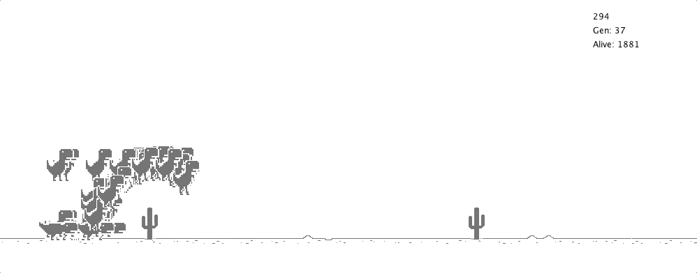

# Dino

This project uses a neuroevolutionary algorithm to self-teach how to play the chrome dino game.

## Neuroevolutionary algorithms
Evolutionary algorithms (EA) are designed to improve (optimize) something. They are vastly used on combinatorial optimization due to their populational approach and their explore/exploit mechanism. They can find a sub-optimal way to solve a problem by evolving previously found solutions. EA could find a solution for the Dino game by itself, but there are some relevant points that discourage us to do that. First, EAs are sensitive to the problem change, i.e. if the input change, it may affect the EA performance. As bigger the change, as worse EA performs. Considering the game world is randomly generated, use just EA is impracticable. The second point is the Dino world is endless. EAs need to know the whole problem to act. Moreover, as bigger is the problem, as more remote the probability to find a feasible sub-optimal solution. Therefore, I hope we agree that, although EA theoretically is able to solve a limited and non-random version of Dino, it is not a good choice.

On the other hand, we have another category of algorithms: reinforcement-learning algorithms, being Artificial Neural Networks (ANN) the most popular example. ANNs are super powerful and can learn how to do something magically (ops, it is not magic, it is mathematics). ANNs can generify their learning and act even the problem changes. Different from EAs, ANNs make decisions on the fly, based on the inputs and on the previous learning. We could use ANNs to play Dino. The inputs could be the scenario and obstacles and the result could be the action Dino should do, but we also have some relevant points here. ANN is a supervised-learning technique. It means we must have several (the more the better) mapped scenarios/probabilities with human answers. The scenarios and answers must be consistent (close scenarios should lead to close answers) to learning be effective. It makes our work very hard. Map a good number of scenarios (generic enough to not overfit our model) and give them a consistent answer is not easy. So please, let's agree it also is not a good choice.

I guess you have already presumed what neuroevolutionary algorithms (NEA) are. Here we go. Let us join the best characteristic of each class of algorithms to make an effective one that can play the Dino game. ANNs can percept the environment around them and make decisions on the fly. EAs can evolve a solution without human intervention. So we will use an EA to improve and evolve the ANN responsible for percept the environment and play Dino through the game. We will replace the traditional ANN's back-propagation algorithm with an automated one based on a fitness function.

## NEA applied to Dino game
The ANN takes 5 input values:
* The world velocity
* The next obstacle horizontal position
* The next obstacle vertical position
* The next obstacle width
* The next obstacle height

And after applying the forward-propagation, it returns two values:
* Should Dino jump?
* Should Dino crawl?

The distance Dino ran is used as the fitness function, i.e. the more distant Dino reaches the fittest its ANN was. The fittest individuals are selected by a tournament technique, they are cloned and go through a mutation process. The mutation process will change the ANN weights randomly in three possible ways:
* Change the weight to a new random value
* Multiply the weight to a random value
* Sum a random value to the weight

The best individual is preserved to the next generation.
